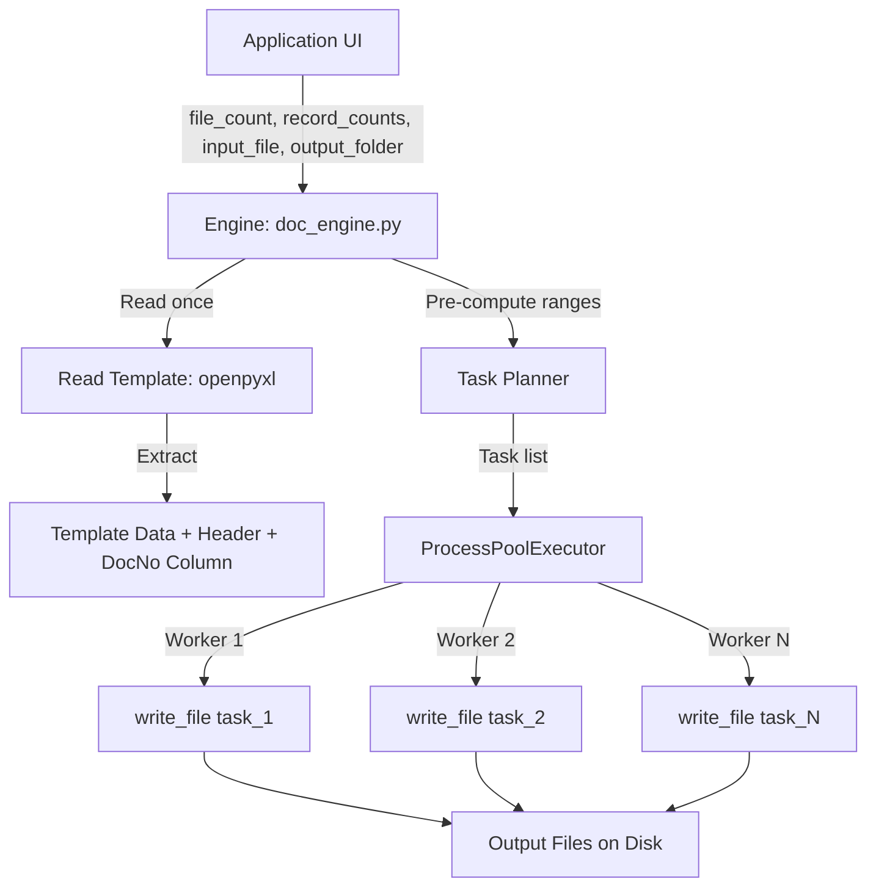

# High-Performance File Generation Engine

## Architecture



## Key Design Decisions

### 1. Pre-computed Document Number Ranges (Zero Contention)
Instead of using locks/shared counters, we **pre-compute** the starting doc number for each task:

| Task | Record Count | Start DocNo | End DocNo |
|------|-------------|-------------|-----------|
| File 1 (10 records) | 10 | Gstr106 | Gstr115 |
| File 2 (10 records) | 10 | Gstr116 | Gstr125 |
| File 1 (1000 records) | 1000 | Gstr126 | Gstr1125 |
| ... | ... | ... | ... |

Each worker knows its exact range — **no shared state, no locks**.

### 2. ProcessPoolExecutor for True Parallelism
- `openpyxl` writing is CPU-bound (XML serialization) → ProcessPool beats ThreadPool
- Workers receive serializable data (lists/tuples, not openpyxl objects)
- Max workers = `min(os.cpu_count(), total_tasks, 8)` to avoid oversubscription

### 3. Template Data Cycling
- Template rows are read once and passed to each worker as a list of tuples
- Workers cycle through template rows using modulo: `template_data[i % template_len]`
- DocumentNo column is overwritten with the unique incremented value

### 4. Progress Reporting
- Use a callback function that the UI passes in
- Workers return status on completion; the orchestrator reports progress

## File Structure

| File | Purpose |
|------|---------|
| `doc_engine.py` | **New** — High-performance parallel engine |
| `application.py` | UI — calls `doc_engine.run()` with progress callback |
| `config.py` | Kept for backward compat, but engine takes params directly |
| `docproducer.py` | **Preserved** — old sequential engine (not modified) |

## Task Generation Example

**Input**: `file_count=20`, `record_counts=[10, 100, 1000]`

**Total tasks**: 20 × 3 = **60 files**
**Total records**: 20×10 + 20×100 + 20×1000 = **22,200 records**
**All 22,200 document numbers are unique globally.**

## Output File Naming

```
output_folder/
├── records_10/
│   ├── file_001.xlsx
│   ├── file_002.xlsx
│   └── ... (20 files)
├── records_100/
│   ├── file_001.xlsx
│   └── ...
└── records_1000/
    ├── file_001.xlsx
    └── ...
```

> [!IMPORTANT]
> The engine will be a **complete rewrite** of the backend, not a modification of `docproducer.py`. The old file is preserved as-is.
